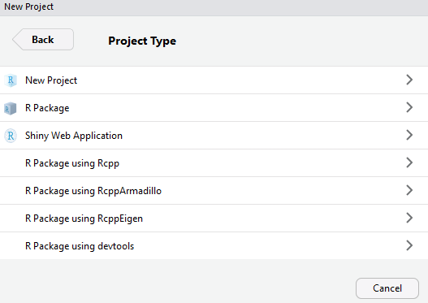

```{r setup, include=FALSE}
knitr::opts_chunk$set(echo = TRUE)
```

Shiny is a package that automatically converts R code into a form suitable to produce dynamic websites in which the user can interact with graphs, model outputs etc.  The style of programming is different to conventional R, in that it is 'reactive'.  This means that the order in which commands are executed depend on user interaction, rather than being pre-defined from the outset.  Whilst this makes writing the software harder, and debugging trickier, the dynamic approach can be an excellent method of engaging the end-user, especially policy-makers, in the decision-process.

# Resources
There are a large number of very good online tutorials for Shiny, both video-based and printed materials.  Look at:
https://shiny.rstudio.com/tutorial/ 
for both types of learning material.

# Aims of this practical
Introduction to shiny, explain the different components of a shiny programme, guidance on good ways in which the software can be used.

# 1. Getting started
## 1.1 Installing shiny and setting up a project
Shiny is an R package, and so can be installed and activated in the usual way from the command line

```{r, eval=FALSE}
install.packages("shiny")
library(shiny)
```

Note that a large number of 'dependency' packages are likely to be installed on the first run.  Shiny works best within projects, which also allows you to set up local or remote version-control via git (see earlier practical for use of projects and git / github).


Select 'New Directory' then ' Shiny Web Application'



Navigate to a suitable folder (I have used BIO8068) and give a name for this first shiny project. You will probably find it useful to initialise a git repository at the same time for version control:


RStudio will restart and the session will be automatically set to the Project File's location, in this case shiny_exercise1.Rproj   Note that as we wanted version control a .gitignore file has automatically been created, and a pre-filled shiny application to display frequency of eruptions from the 'Old Faithful' geothermal geyser in the United States Yellowstone National Park, which erupts approximately 40 to 120 seconds https://en.wikipedia.org/wiki/Old_Faithful RStudio will recognise that this is a shiny app, therefore you will see a 'Run App' button at the top of the app.R window.  Click this and the app should run:


Play around with the slider and note how the graph changes, and also try clicking on the 'Open in Browser' button. Whilst you are running the app something similar to the following is displayed in the console window:

```{r, eval=FALSE}
> shiny::runApp()
Loading required package: shiny
Warning: package ‘shiny’ was built under R version 3.4.4
Listening on http://127.0.0.1:5760
```


What do you think these four separate lines mean?  Where is the command prompt, and how do you get it back?

## 1.2 Alternative way of running a shiny app
Instead of clicking on the 'Run App' button, I usually find it more useful to step through the programme using the CTRL-Enter (CMD-Return on a Mac) buttons on the keyboard. Step through the app.R programme via CTRL-Enter, noting that it actually only contains a few 'lines' of code.  A lot of the separate lines end with a closing bracket or a comma. This is one of the things that makes debugging shiny apps harder.

## 1.3 Objects in a shiny app
Note that you now have two R objects in your RStudio Environment window, ui and server. Print them in the Console by entering their names. First the **ui** R object. You might be surprised at what you see:

```{r, eval=FALSE}
> ui
<div class="container-fluid">
  <h2>Old Faithful Geyser Data</h2>
  <div class="row">
    <div class="col-sm-4">
      <form class="well">
        <div class="form-group shiny-input-container">
          <label class="control-label" for="bins">Number of bins:</label>
          <input class="js-range-slider" id="bins" data-min="1" data-max="50" data-from="30" data-step="1" data-grid="true" data-grid-num="9.8" data-grid-snap="false" data-prettify-separator="," data-prettify-enabled="true" data-keyboard="true" data-data-type="number"/>
        </div>
      </form>
    </div>
    <div class="col-sm-8">
      <div id="distPlot" class="shiny-plot-output" style="width: 100% ; height: 400px"></div>
    </div>
  </div>
</div>
```

Instead of the usual R commands, you actually receive a mass of incomprehensible "hypertext markup language" or HTML. This is because web browsers such as Chrome use HTML to display their content. Fortunately you do not need to learn how to write HTML to produce interactive websites, as R will do the conversion for you.

Next the **server** R object:

```{r, eval=FALSE}
> server
function(input, output) {
   
   output$distPlot <- renderPlot({
      # generate bins based on input$bins from ui.R
      x    <- faithful[, 2] 
      bins <- seq(min(x), max(x), length.out = input$bins + 1)
      
      # draw the histogram with the specified number of bins
      hist(x, breaks = bins, col = 'darkgray', border = 'white')
   })
}
```

The **server** R object is actually an R _function_ that manages the inputs received when the user clicks on various components of the user interface in the browser. It receives inputs from the browser via the `input` structure. You can see the line:

` bins <- seq(min(x), max(x), length.out = input$bins + 1)`

and here the `input$bins` is actually detecting where you have moved the slider bar in the user interface in the browser. Likewise the server object also controls where to put the results of any analyses, such as graphs, tables, maps etc. Here a histogram is being displayed, using the basic R `hist` function. The key line is:

`output$distPlot <- renderPlot({`

which the server uses to decide where to put the `output` from its analyses. We will look at these in more detail shortly.

# 2. The structure of a shiny app
The structure of the main app.R programme is actually very simple containing just three components:

* a user interface object ui
* a server function server
* a call to the shinyApp function

The user interface object contains all the information about the layout of the Graphical User Interface (GUI), drop-down menus, maps, graphs etc.  The server function is generally simpler, taking as inputs information from the sliders or menus, and directing outputs to the appropriate outputs defined in the user interface.

Spend some time studying the example application.  How are the different components of the input and output referred to in the ui and server code. 

Large shiny apps may require import or export of data, model results, maps etc. from external files. I generally find it easiest to debug these as separate R scripts initially, to ensure that the basic graphs display as expected, especially when using ggplot or maps.  Then these scripts can be simplified to just read the data, and the main app.R file can call them via the "source" command to make the data available, whilst avoiding the app.R file becoming too long.

# 3. Version control and navigating your R scripts with table of contents
Shiny scripts must be saved before they can be run.  This can cause problems if you modify a script, save it, try and run it, but then it crashes.  If you cannot remember exactly what you edited, especially if you have made major changes, it may take a while to go back to a properly functioning script.  Therefore, test your scripts regularly, and when you have one that works well, make a 'commit' using 'git', recording a comment.

Before going any further, commit the .gitignore, app.R and .Rproj files using the git tab at the top right of RStudio, and provide a sensible comment such as "initial commit of example script" or similar.

Unfortunately, as app.R scripts in effect only contain the commands to create two large objects (ui and server) they can become quite long and difficult to navigate. Remember that after a comment if you put four `####` or four `----` symbols, the text of that line will automatically be added to a "Table of Contents" (ToC).  This can be accessed from the small button at the top right of the app.R window, or from the list at the bottom.

Edit your app.R script to add ToC comments for various components in both the ui and server sections.  See what happens when you "collapse" code from either the main menu, or the down-arrows next to the line numbers.

# 4. Minor edits to `app.R`
Now make some minor edits to the app.R script, re-running each time, to gain better insight and confidence in this style of programming. Try, for example:

* changing the application title
* modifying the minimum and maximum number of 'bins' that can be displayed
* changing the colours in the histogram
* change title, x and y labels in the histogram
* change the text for the slider

# 5. Laying out the user-interface: basics
In this section we are going to create a simple page with text, a side panel etc. This can all be controlled in the ui section.  Create a new R script called `basic_layout.R` and enter the following. Note the use of four `----` to create a ToC.  This is the absolute minimum for a shiny app, so before you run it, think what you are going to get displayed!

```{r, eval=FALSE}
library(shiny)

# Define UI ----
ui <- fluidPage(
  
)

# Define server logic ----
server <- function(input, output) {
  
}

# Run the app ----
shinyApp(ui = ui, server = server)
```

Hopefully you guessed right as it was fairly obvious!

## 5.1 Headings and subheadings
Now add the following to your `fluidPage()` definition, which is currently empty, and re-run:

```{r, eval=FALSE}
  titlePanel("title panel"),

  sidebarLayout(
    sidebarPanel("sidebar panel"),
    mainPanel("main panel")
  )
```

This type of design is very common in shiny apps, as it gives a simple, clean approach with a `mainPanel` and `sidebarPanel`.  Sometimes you might want the `sidebarPanel` on the right of the screen; look at the function's help page and work out how to change its position.

Text containing headers (level `h1`), subheadings (`h2`, `h3` etc.) can easily be added. e.g.

```{r, eval=FALSE}
mainPanel(
  h1("This is the main heading for my app"),
   h2("here is a subheading")
)
```

## 5.2 Paragraphs of text, images etc.
Often you might want the "landing page" of your website to contain descriptive text to guide the user as to what to expect, or static photos or graphics.  The `p()` function creates a new paragraph with containing text, `strong()` is text in bold, `em()` text in italics etc. Try adding the following or similar to your `mainPanel()` :

```{r, eval=FALSE}
      mainPanel(
         p("This website will be to help planners assess potential windfarm
           development areas in Cumbria, and achieve a ",strong("balance ),
           "between different ", em("interest groups"), "and other users."
           )
       )
```

Take advantage of RStudio's automatic indentation and open-bracket, close-bracket matching to help you when writing text.  Note that the above text is written over three lines, but that is unlikely to be how it is displayed, especially in Chrome.  How might you insert a new line or break? 

To display static images, it is generally best to store them in a www subfolder. Ideally they can simply be displayed anywhere on the screen using the `img()` function, but "base64 encoding" of images can sometimes cause problems in my experience.  Download the file `UKwindfarm.png` from Canvas, and save it to a **new `www` folder** inside your main project folder.  To read the file, add the line (`base64enc` controls the encoding; `dataURI` stands for Universal Resource Indicator):

`wfarm <- base64enc::dataURI(file="www/UKwindfarm.png", mime="image/png")`

near the top of your script.  Next add the line

`img(src=wfarm)`

somewhere in your ui function.  Depending on where you place this `img()` function will alter the position of the photo on your web-page.  You can also resize it if needed.


# 6. Layout user interface: shiny widgets
Shiny widgets provide a primary method for users to interact with your web application. There are dozens of widgets, including check boxes, drop-down lists, option boxes, date boxes, action buttons etc.  These are easy to add, but it is important to give them a clear, easily recognised identifier: you will need this in the server function of the app.R script.

Begin by adding a 'Submit' button and check boxes to the side panel of your dummy application; first the code for a submit button:

```{r, eval=FALSE}
sidebarPanel("MySidebar",
                   h3("a button"),
                   actionButton(inputId="my_submitstatus",
                   label="Submit")
```

Note: as a learning exercise, I'm not giving you the full code for the `sidebarPanel()` function. Can you work out where the above code should go, or any additional brackets or commas?  An important part of the text is the `inputId`, which by default is the first piece of text after the `actionButton` command. It is usually best to explicitly name `inputId` (note: upper case I), and the label to appear on the button.  Nothing happens if you run the script, as no code has been setup in the server to do anything yet.

Once you have the Submit button displayed correctly, try and create some checkboxes, with a default one selected, in the `sidebarPanel()`.  Again, I leave it to you to work out commas, brackets etc. RStudio will help with bracket matching etc.

```{r, eval=FALSE}
checkboxGroupInput(inputId = "my_checkgroup", 
                   h3("Checkbox group"), 
                   choices = list("Woodland" = 1, 
                                  "Grassland" = 2, 
                                  "Urban" = 3),
                   selected = 1)
```

Check the code runs and displays, although of course as the `server` function is not linked, nothing will happen yet.  Finally, slightly modify your code to use the `radioButtons()` function (renaming the `inputId` and `h3` to something sensible and note the difference.


Finally, smarten up your application by adding a title: see the 'Old Faithful' geyser application (**`app.R`**) for the syntax and relevant function to add a title pane.

# 7. The server function
## 7.1 Taking data from GUI inputs
The server function takes the dynamic inputs from the GUI (check boxes, radio buttons, sliders etc.), undertakes any analyses as needed, and displays the results back to the GUI.  It only takes one input variable (called 'input') but the separate   components from the GUI are referenced through this variable.  So in the above example, the inputs would be

`input$my_checkgroup`

and

`input$my_submitstatus`

The server function notes whenever these change, and re-runs and re-displays any necessary output back to the GUI.  Go back to the original app.R script that you first used, that displays eruptions from the 'Old Faithful' geothermal geyser. In the `sidebarPanel` section of the gui you will see the following code:

```{r, eval=FALSE}
sliderInput("bins",
             "Number of bins:",
             min = 1,
             max = 50,
             value = 30)
 ),
```

Why is there a comma after the final closing bracket?

This is a pre-written example, but I think it would be better written with all the variable names written out in full:

```{r, eval=FALSE}
sliderInput(inputId = "bins",
            label = "Number of bins:",
            min = 1,
            max = 50,
            value = 30)
 ),
```

This makes it clearer that bins is the internal R identifier used for this shiny input.  Now look at the following lines in the server function where you can see this code:

`bins <- seq(min(x), max(x), length.out = input$bins + 1)`

This creates a variable called `bins`, which basically works out the minimum and maximum values for the Old Faithful eruption data, but the length is calculated dynamically.  Notice how it uses `input$bins` to obtain the value whenever the user adjusts the slider.  This is why you need good, clear, sensible names for the inputId of each of your GUI input widgets.

7.2 Displaying dynamic data from the server back to the GUI
To display dynamic information back to the GUI, you need to let the GUI know the type of data to be displayed (graph, table, map, text etc.), and where to put it (main panel, side panel, in a column, in a new row).  The server function sends its results to the outputId of the appropriate section in the GUI.  Staying with the app.R 'Old Faithful' geyser example, note the following lines in the ui object:

```{r, eval=FALSE}
mainPanel(
          plotOutput("distPlot")
          )
```

The `plotOutput()` function, as the name suggests, allows plotting of graphs using the default R shiny formats.  Again, I think that it is wiser to give the ID names explicitly:

```{r, eval=FALSE}
mainPanel(
          plotOutput(outputId = "distPlot")
          )
```

Check the help pages for the `plotOutput()` function and you will see a large number of options, including controlling size, resolution etc.

# 8. Modifying your `basic_layout.R` application to show habitats
We will finish by displaying aggregated frequency histograms of three broad habitat classes in Great Britain, derived from the CEH 2007 land cover map at 10 km.  The file `habitats.csv` contains the proportion of each 10 km grid cell in GB occupied by wood, grass and urban (I have merged the original CEH classes of different woodland, grass and urban/suburban types for simplicity).  Carry out the following steps:

* Put the `habitats.csv` file in your `www` subfolder
* read the contents of the file into the variable habitats near the top of your script, before the `ui` is created
* modify the `mainPanel()` function to contain a `plotOutput()` function, giving the latter the `outputId = "habitats_plot"`

**Note**: If you are having problems with this section, try creating a temporary R script which reads in the habitats.csv file, creates a simple histogram onscreen etc. all outside of shiny. It can be difficult to "debug" shiny applications, so I often check file import from csv files, basic plots or statistics etc. separately before trying to incorporate into the actual shiny app.

To check that the plotting is working correctly, begin by creating a histogram of only the woodland coverage. In your server function add the following code:

```{r, eval=FALSE}
   output$habitats_plot <- renderPlot(
      hist(habitats[,1])
   )
```

Now, see if you can make the code 'reactive' so that the plot changes every time one of the radio buttons is selected (Hints: think about the columns numbers for the three habitats, and what might be encoded by your radio buttons in the GUI. The numbers from the radio buttons are returned as text, so you will need to use the `as.numeric()` function to ensure the correct columns from habitats are displayed).

Hopefully you will obtain something similar to the following:


Every time you click on a different radio button the frequency histogram will change.

# 9. Finishing touches
Smarten up your application; there are a number of simple changes to explore, that will improve your confidence:

* the 'Submit' button doesn't do anything so remove it
* add a slider to change the number of bins in your 
* change the title of your histogram and axis labels
* include a 'dynamic' checkbox with the `checkboxInput()` function to autoscale the y-axis (default) or use a fixed y-axis to make comparisons between the three habitats easier. 
* change the fill colour etc. of the histogram bars

**Note**: shiny will also accept plots produced with ggplot2 which we will explore later


